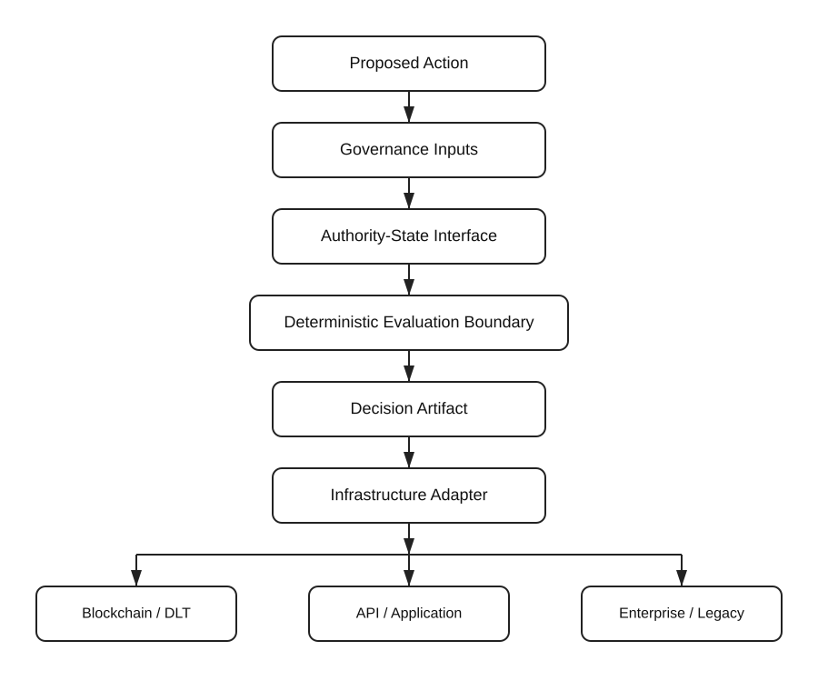

# Reference Architecture

## Purpose

This document describes the public reference architecture for the VTI Deterministic Governance Reference repository.

It is intentionally high-level and non-normative.

It does not define conformance with any VTI Foundation Inc. standard, certification program, or proprietary implementation.

## Architectural Principle

The reference architecture separates:

* the proposed digital action;
* the governance state relevant to that action;
* deterministic evaluation of that state;
* the resulting decision artifact; and
* the infrastructure that ultimately records, transports, or executes the action.

The infrastructure layer is not treated as the source of governance authority merely because it performs execution.

## Reference Flow

Proposed Action
      │
      ▼
Governance Inputs
      │
      ▼
Authority State
      │
      ▼
Deterministic Evaluation Boundary
      │
      ▼
Decision Artifact
      │
      ▼
Infrastructure Adapter
      │
      ├── Distributed ledger / blockchain
      ├── API or application
      ├── enterprise platform
      └── legacy system

## Proposed Action

A proposed action is a request that may create an operational, legal, financial, administrative, or other consequential effect.

The reference architecture evaluates the action before downstream execution occurs.

## Governance Inputs

Governance inputs represent the information required to evaluate whether the proposed action is eligible to proceed.

Examples may include:

* identity-related assertions;
* authority or permission state;
* policy references;
* jurisdiction or scope information;
* temporal conditions;
* evidence references; and
* other contextual inputs required by the applicable implementation.

This repository does not define the complete set of governance inputs required by any VTI standard.

## Authority State

Authority state represents the machine-consumable state relevant to whether an action is authorized or eligible for further evaluation.

The public reference interface is intentionally limited.

It is not a complete implementation of the Authority-State Layer (ASL) and should not be interpreted as a normative ASL definition.

## Deterministic Evaluation Boundary

The deterministic evaluation boundary represents the point at which defined governance inputs are evaluated according to an identified evaluation context.

The purpose of the boundary is to make the relationship between input state and resulting output explicit and reproducible.

Internal algorithms, proprietary methods, standards requirements, certification logic, and unpublished technical mechanisms are outside the scope of this repository.

## Decision Artifact

A decision artifact is a machine-readable representation of the result of an evaluation.

A public reference decision artifact may contain information such as:

* a unique decision identifier;
* the action or request identifier;
* the evaluation outcome;
* the relevant authority-state reference;
* an evaluation or policy-version reference;
* a timestamp; and
* integrity or provenance information appropriate to the implementation.

The schema published in this repository is illustrative and non-normative.

## Infrastructure Adapter Boundary

The infrastructure adapter connects the governance outcome to an external execution, recording, or transport environment.

Potential environments include:

* distributed ledgers;
* blockchain networks;
* smart-contract systems;
* APIs;
* enterprise applications;
* identity infrastructure;
* workflow systems; and
* legacy platforms.

This boundary is intentionally infrastructure-neutral.

A blockchain or other execution environment may verify, transport, record, or act upon a decision artifact without becoming the authoritative source of the governance model itself.

## Relationship to VTI Architecture

VTI Foundation Inc. develops standards and architecture relating to deterministic governance, including Trust-State®, the Authority-State Layer (ASL), and the Parallel Authority Ledger (PAL).

This public reference architecture exposes only a limited integration view.

It does not disclose or define the complete internal behavior of those architectures.

## Non-Normative Status

Nothing in this document:

* establishes conformance with a VTI standard;
* defines certification requirements;
* grants certification or verification status;
* replaces an official VTI specification; or
* expands the scope of the license covering this repository.

See `../NOTICE.md` for additional intellectual-property, trademark, and certification information.
